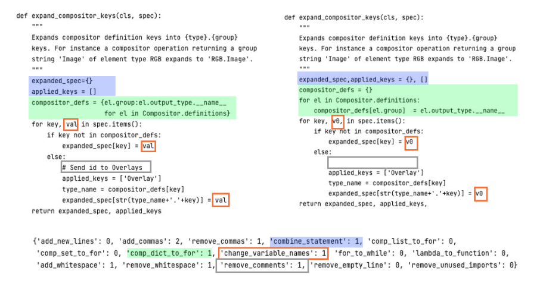

# Contrastive Learning for Valid Code Generation

### Code transformation example



### Implementations
    
#### Style transfer 
1. Comprehensions to loop: Comprehensions are a concise way to create a new list, set, or dictionary by performing computations on iterable objects and filtering the results based on conditions. We changed comprehensions to a series of for loops and if statements while considering nested comprehensions as well.
2. For loop to while loop: Change for loop to while statement when it involves the range function.
3. Lambda to Function: a lambda function is a small function with an arbitrary number of arguments and a single statement. We extract these lambda functions in the codes and transform them to use the ```def``` keyword.
4. Combine statements: Variable assignments in separate statements are combined if the number of targets and values match, no values to be assigned are included in the targets, and the yield keyword is not used.

#### Change of variable names
1. Local variable name change: Change local variable names inside function definitions by first detecting possible names excluding attributes, function names, parameter names, and non-local or global variable names since modifying these variables may break the codes. Then, we named variable names as ```v0```, ```v1```, ... if these variable names are not in the built-in scope, keywords, soft keywords, or used names.

#### Removing texts with semantics

1. Remove comments: Remove comments and unassigned strings. When processing code snippets for summarization tasks, this helps to ensure that the resulting summary is based solely on the code's structure and logic rather than any additional information provided through comments.
2. Remove unused imports: Remove unused imports. Imported names can have an effect on the understandability of codes for humans, which may be similarly applied to language models.

#### Adding characters
1. Adding new line character: 
Insert new lines of code for each new line character in the code.
2. Adding commas : Add commas at the end of lists, tuples, sets, and dictionary declarations.
3. Adding white spaces : Add one white space character in applicable locations of the code.

#### Removing characters
1. Remove new line character: Remove empty lines.
2. Removing white spaces: Remove existing white space characters from the code snippet.
3. Remove commas: Remove commas at the end of list, tuple, set, and dictionary declarations.
